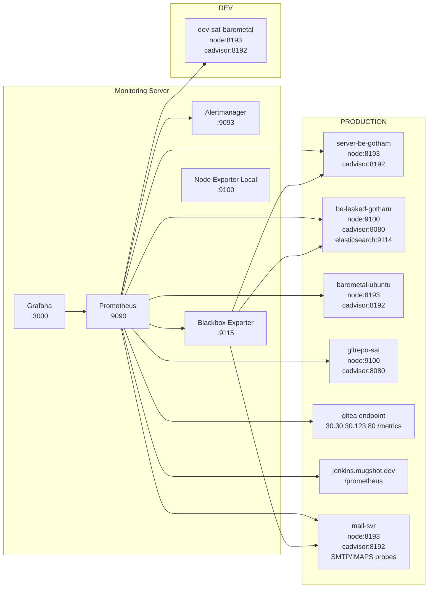
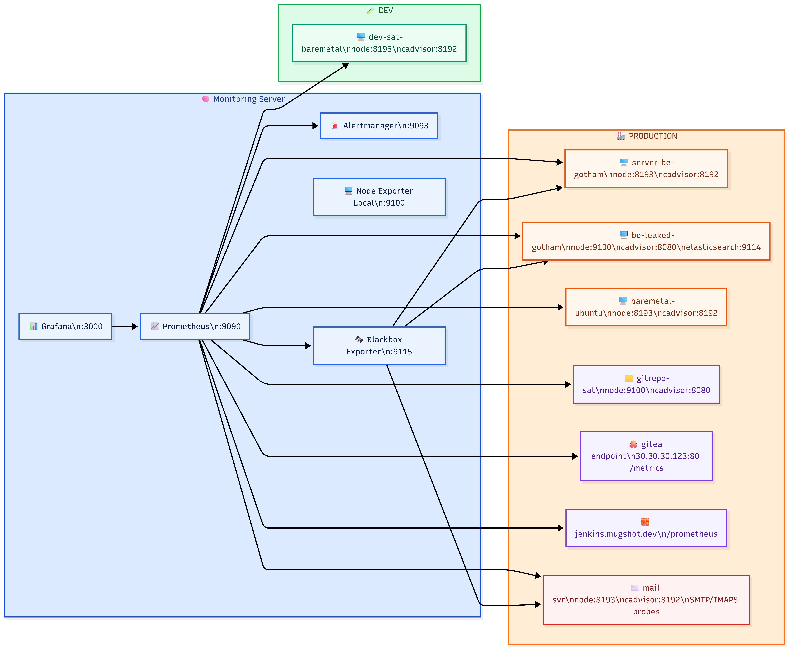

# Monitoring Stack (Prometheus + Grafana + Alertmanager)

Repository ini berisi konfigurasi **monitoring terpusat** untuk lingkungan **development** dan **production** berbasis Docker Compose.

Komponen utama:

- **Prometheus** untuk scraping metrics, rule evaluation, dan alert generation.
- **Alertmanager** untuk routing notifikasi berdasarkan severity, environment, dan role.
- **Grafana** untuk dashboard observability dan visualisasi metrik.
- **Blackbox Exporter** untuk HTTP/SMTP/TCP probing.
- **Exporter host/service**: Node Exporter, cAdvisor, PM2 Exporter, Elasticsearch Exporter, Postfix Exporter.

> Dokumentasi ini dirancang sebagai referensi operasional harian (deploy, validasi, troubleshooting).

## Quick Start

```bash
cd /home/devel/monitoring
docker compose up -d
docker compose ps
```

## Daftar Isi

- [Arsitektur Ringkas](#arsitektur-ringkas)
- [Topologi](#topologi)
- [Struktur Repository](#struktur-repository)
- [Konfigurasi Utama](#konfigurasi-utama)
- [Daftar Job Scrape Prometheus](#daftar-job-scrape-prometheus)
- [Alerting Rules yang Aktif](#alerting-rules-yang-aktif)
- [Routing Notifikasi Alertmanager](#routing-notifikasi-alertmanager)
- [Provisioning Grafana](#provisioning-grafana)
- [Cara Menjalankan](#cara-menjalankan)
- [Operasional Harian](#operasional-harian)
- [Security Notes (Penting)](#security-notes-penting)

## Arsitektur Ringkas

- Monitoring server menjalankan 5 container utama: `prometheus`, `alertmanager`, `grafana`, `blackbox-exporter`, `node-exporter-local`.
- Prometheus scrape berbagai endpoint metrik dari server target (port 9100/8080/9209/9114/9154) dan probe blackbox.
- Alert rules dievaluasi setiap 15 detik, lalu dikirim ke Alertmanager.
- Alertmanager route notifikasi berdasarkan severity/env/role (critical, prod warning, mail, elasticsearch, gitea, dev, info).
- Grafana otomatis provision datasource + dashboard dari folder repository.

## Topologi

### Diagram Mermaid



### Export PNG

Simpan hasil export diagram ke path berikut:

- `docs/images/monitoring-topology.png`



## Struktur Repository

- `docker-compose.yml` — service monitoring stack.
- `prometheus/prometheus.yml` — konfigurasi scrape + alertmanager + rule files.
- `prometheus/web.yml` — basic auth untuk UI/API Prometheus.
- `prometheus/rules/*.yml` — kumpulan alert rules per domain.
- `alertmanager/alertmanager.yml` — route, receiver, inhibit, SMTP.
- `alertmanager/templates/email.tmpl` — template email HTML/text.
- `blackbox/blackbox.yml` — module probe HTTP/TCP/SMTP/ICMP.
- `grafana/provisioning/datasources/prometheus.yml` — datasource provisioning.
- `grafana/provisioning/dashboards/dashboards.yml` — dashboard provider provisioning.
- `grafana/provisioning/dashboards/*.json` — dashboard JSON (termasuk Gitea).
- `scripts/*.sh` — deploy + instalasi agents di target host.
- `docs/topology.mmd` — source kode Mermaid topologi.
- `docs/images/` — folder output image diagram (PNG/SVG).

---

## Konfigurasi Utama

### 1) Docker Compose services

Service aktif:

1. `prometheus` (`prom/prometheus:v2.51.2`)
   - retention: 30d / 10GB
   - rule mount: `./prometheus/rules`
   - config auth web: `prometheus/web.yml`
2. `alertmanager` (`prom/alertmanager:v0.27.0`)
3. `grafana` (`grafana/grafana:10.4.2`)
   - provisioning aktif dari `./grafana/provisioning`
4. `blackbox-exporter` (`prom/blackbox-exporter:v0.25.0`)
5. `node-exporter-local` (`prom/node-exporter:v1.8.0`)

### 2) Prometheus global

- `scrape_interval: 15s`
- `evaluation_interval: 15s`
- alerting target: `alertmanager:9093`
- rule files:
  - `node_alerts.yml`
  - `docker_alerts.yml`
  - `elasticsearch_alerts.yml`
  - `mail_alerts.yml`
  - `pm2_alerts.yml`
  - `jenkins_alerts.yml`

### 3) Blackbox modules

- `http_2xx`
- `http_2xx_insecure`
- `tcp_connect`
- `smtp_starttls`
- `icmp`

### 4) Grafana provisioning

- Datasource default: **Prometheus** (`http://prometheus:9090`) via basic auth env vars.
- Dashboard provider path: `/etc/grafana/provisioning/dashboards`.

---

## Daftar Job Scrape Prometheus

### Internal

- `prometheus`
- `blackbox`

### Aplikasi/Platform

- `jenkins` (`https://jenkins.mugshot.dev/prometheus/`)
- `gitea` (`http://30.30.30.123:80/metrics`, bearer auth)

### Host & container metrics

- `node-dev-sat-baremetal`
- `cadvisor-dev-sat-baremetal`
- `node-server-be-gotham`
- `cadvisor-server-be-gotham`
- `node-be-leaked-gotham`
- `cadvisor-be-leaked-gotham`
- `node-baremetal-ubuntu`
- `cadvisor-baremetal-ubuntu`
- `node-mail-svr`
- `cadvisor-mail-svr`
- `node-prod-gitrepo-sat`
- `cadvisor-prod-gitrepo-sat`
- `elasticsearch`

### Probing via blackbox

- `blackbox-http`
- `blackbox-smtp`
- `blackbox-tcp`

---

## Alerting Rules yang Aktif

### `node_alerts.yml`

- `InstanceDown`
- `HighCPUUsage`, `CriticalCPUUsage`
- `HighMemoryUsage`, `CriticalMemoryUsage`
- `DiskSpaceWarning`, `DiskSpaceCritical`, `DiskWillFillIn4Hours`
- `HighDiskIOWait`
- `HighNetworkReceive`
- `HighLoadAverage`
- `SystemReboot`

### `docker_alerts.yml`

- `ContainerDown`
- `ContainerHighCPU`
- `ContainerHighMemory`
- `ContainerMemoryNoLimit`
- `ContainerRestartLoop`
- `ContainerOOMKilled`
- `DockerDaemonDown`

### `elasticsearch_alerts.yml`

- `ElasticsearchClusterRed`, `ElasticsearchClusterYellow`
- `ElasticsearchNodesMissing`
- `ElasticsearchJVMHeapHigh`, `ElasticsearchJVMHeapCritical`
- `ElasticsearchDiskWatermarkLow`, `ElasticsearchDiskWatermarkHigh`
- `ElasticsearchSlowQueries`
- `ElasticsearchUnassignedShards`
- `ElasticsearchExporterDown`

### `mail_alerts.yml`

- `SMTPDown`, `IMAPSDown`
- `PostfixQueueHigh`, `PostfixQueueCritical`, `PostfixOldMessages`
- `SMTPSlowResponse`

### `pm2_alerts.yml`

- `PM2ProcessStopped`
- `PM2ProcessRestarting`, `PM2ProcessRestartCritical`
- `PM2HighMemory`
- `PM2HighCPU`

### `jenkins_alerts.yml`

- `JenkinsDown`
- `JenkinsHealthCheckDegraded`
- `JenkinsExecutorUsageHigh`, `JenkinsExecutorUsageCritical`
- `JenkinsQueueLengthHigh`

---

## Routing Notifikasi Alertmanager

Default grouping:

- `group_by: [alertname, server, env]`
- `group_wait: 10s`
- `group_interval: 5m`
- `repeat_interval: 4h`

Route spesifik:

- `severity=critical` → `critical-receiver` (repeat 1h)
- `env=production + severity=warning` → `prod-receiver` (repeat 8h)
- `role=mail` → `mail-receiver` (repeat 1h)
- `role=elasticsearch` → `elastic-receiver` (repeat 2h)
- `role=gitea` → `gitea-receiver` (repeat 4h)
- `env=development` → `dev-receiver` (repeat 8h)
- `severity=info` → `info-receiver` (repeat 24h)

Inhibit rules:

- `InstanceDown` men-suppress alert turunan host yang sama
- `critical` men-suppress `warning` yang sejenis pada server sama
- `ElasticsearchClusterRed` men-suppress `ElasticsearchClusterYellow`

---

## Provisioning Grafana

- Datasource Prometheus otomatis saat startup.
- Dashboard provider mode file provisioning.
- Dashboard Gitea ada di:
  - `grafana/provisioning/dashboards/gitea-overview.json`

---

## Cara Menjalankan

### Jalankan stack

1. Isi `.env` (lihat variabel pada `docker-compose.yml`)
2. Start:

```bash
cd /home/devel/monitoring
docker compose up -d
```

### Validasi konfigurasi Prometheus

```bash
docker compose exec prometheus promtool check config /etc/prometheus/prometheus.yml
```

### Restart service penting setelah perubahan

```bash
docker compose restart prometheus
docker compose restart alertmanager
docker compose restart grafana
```

### Script deploy cepat

```bash
./scripts/deploy.sh
```

---

## Operasional Harian

### Cek target scrape

- Prometheus UI: `http://<monitoring-host>:9090/targets`

### Cek health stack

```bash
docker compose ps
docker compose logs --tail=100 prometheus
docker compose logs --tail=100 alertmanager
docker compose logs --tail=100 grafana
```

### Install agent di server target

```bash
sudo ./scripts/install-agents.sh --with-docker --with-pm2
sudo ./scripts/install-agents.sh --with-elasticsearch
sudo ./scripts/install-agents.sh --with-postfix
```

---

## Security Notes (Penting)

1. **Jangan commit secret** (`.env`, password SMTP, token bearer, kredensial auth).
2. Saat ini ada secret hardcoded di beberapa config operasional — sangat disarankan:
   - pindahkan ke env/secret store,
   - rotate credential yang sudah terlanjur terekspos.
3. Batasi akses network exporter hanya dari monitoring server.
4. Gunakan TLS/reverse proxy untuk endpoint publik (Grafana/Prometheus/Alertmanager).

---

