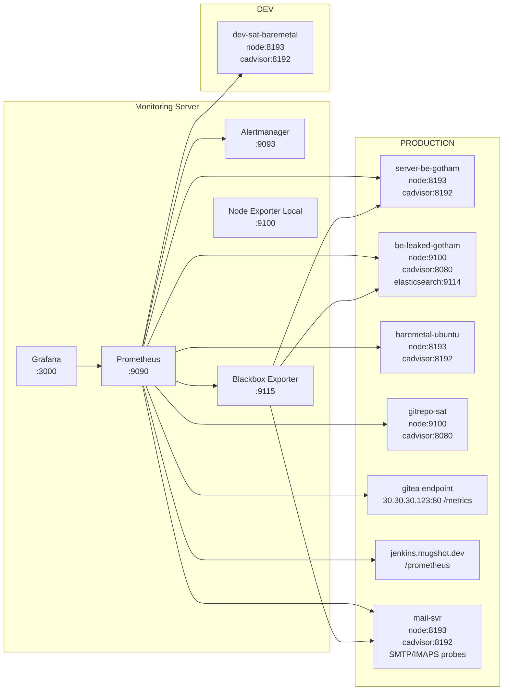

# Monitoring Stack (Prometheus + Grafana + Alertmanager)


This repository contains a production-ready monitoring stack for mixed infrastructure (development + production), powered by Prometheus, Alertmanager, Grafana, and Blackbox Exporter.

Repositori ini berisi stack monitoring siap produksi untuk infrastruktur campuran (development + production), menggunakan Prometheus, Alertmanager, Grafana, dan Blackbox Exporter.

---

## Table of Contents / Daftar Isi

- [Quick Start](#quick-start)
- [Prerequisites](#prerequisites)
- [Architecture Overview / Ringkasan Arsitektur](#architecture-overview--ringkasan-arsitektur)
- [Topology](#topology)
- [Repository Structure / Struktur Repository](#repository-structure--struktur-repository)
- [Core Configuration / Konfigurasi Utama](#core-configuration--konfigurasi-utama)
- [Prometheus Scrape Jobs](#prometheus-scrape-jobs)
- [Alert Rules Summary](#alert-rules-summary)
- [Alertmanager Routing Summary](#alertmanager-routing-summary)
- [Daily Operations / Operasional Harian](#daily-operations--operasional-harian)
- [Security Notes / Catatan Keamanan](#security-notes--catatan-keamanan)
- [Contributing](#contributing)
- [License](#license)

---

## Quick Start

```bash
cd /home/devel/monitoring
docker compose up -d
docker compose ps
```

---

## Prerequisites

Before running this stack, ensure the following requirements are available:

- Docker Engine 24+ and Docker Compose plugin
- Linux host with systemd
- Open ports for monitoring services (`3000`, `9090`, `9093`, `9115`)
- Network access from monitoring server to exporter targets
- `.env` file for runtime secrets and environment settings

Sebelum menjalankan stack ini, pastikan:

- Docker Engine 24+ dan Docker Compose plugin sudah terpasang
- Host Linux menggunakan systemd
- Port layanan monitoring terbuka (`3000`, `9090`, `9093`, `9115`)
- Monitoring server bisa mengakses endpoint exporter target
- File `.env` tersedia untuk secret dan variabel environment

---

## Architecture Overview / Ringkasan Arsitektur

**EN**

- Monitoring server runs 5 primary services: `prometheus`, `alertmanager`, `grafana`, `blackbox-exporter`, `node-exporter-local`.
- Prometheus scrapes application and host metrics from multiple target servers.
- Alert rules are evaluated every 15 seconds and routed through Alertmanager.
- Grafana is provisioned automatically for datasource and dashboards.

**ID**

- Monitoring server menjalankan 5 service utama: `prometheus`, `alertmanager`, `grafana`, `blackbox-exporter`, `node-exporter-local`.
- Prometheus melakukan scrape metrics aplikasi dan host dari banyak server target.
- Alert rule dievaluasi setiap 15 detik lalu dirouting oleh Alertmanager.
- Grafana diprovision otomatis untuk datasource dan dashboard.

---

## Topology

### Mermaid Source



---

## Repository Structure / Struktur Repository

- `docker-compose.yml` — main monitoring services
- `prometheus/prometheus.yml` — scrape config + rule files + alertmanager integration
- `prometheus/web.yml` — Prometheus basic auth config
- `prometheus/rules/*.yml` — rule groups (node, docker, mail, PM2, Elasticsearch, Jenkins)
- `alertmanager/alertmanager.yml` — routing tree, receivers, inhibit rules
- `alertmanager/templates/email.tmpl` — custom email templates
- `blackbox/blackbox.yml` — probe modules (HTTP/TCP/SMTP/ICMP)
- `grafana/provisioning/**` — datasource and dashboard provisioning
- `scripts/*.sh` — deployment and remote agent installation helpers
- `docs/topology.mmd` — Mermaid source for topology diagram
- `docs/images/` — image export directory

---

## Core Configuration / Konfigurasi Utama

### Runtime services

- Prometheus: `prom/prometheus:v2.51.2`
- Alertmanager: `prom/alertmanager:v0.27.0`
- Grafana: `grafana/grafana:10.4.2`
- Blackbox Exporter: `prom/blackbox-exporter:v0.25.0`
- Node Exporter (local): `prom/node-exporter:v1.8.0`

### Prometheus globals

- `scrape_interval: 15s`
- `evaluation_interval: 15s`
- alerting target: `alertmanager:9093`

### Blackbox modules

- `http_2xx`
- `http_2xx_insecure`
- `tcp_connect`
- `smtp_starttls`
- `icmp`

---

## Prometheus Scrape Jobs

Key jobs currently configured:

- Core: `prometheus`, `blackbox`
- App: `jenkins`, `gitea`
- Host/container: `node-*`, `cadvisor-*`, `elasticsearch`
- Probe: `blackbox-http`, `blackbox-smtp`, `blackbox-tcp`

> Full details are defined in `prometheus/prometheus.yml`.

---

## Alert Rules Summary

Active rule groups:

- `node_alerts.yml`
- `docker_alerts.yml`
- `elasticsearch_alerts.yml`
- `mail_alerts.yml`
- `pm2_alerts.yml`
- `jenkins_alerts.yml`

> Rule expressions and thresholds are maintained in `prometheus/rules/`.

---

## Alertmanager Routing Summary

Primary routes:

- `severity=critical` → `critical-receiver`
- `env=production + severity=warning` → `prod-receiver`
- `role=mail` → `mail-receiver`
- `role=elasticsearch` → `elastic-receiver`
- `role=gitea` → `gitea-receiver`
- `env=development` → `dev-receiver`
- `severity=info` → `info-receiver`

> Inhibit rules are configured in `alertmanager/alertmanager.yml`.

---

## Daily Operations / Operasional Harian

### Validate Prometheus config

```bash
docker compose exec prometheus promtool check config /etc/prometheus/prometheus.yml
```

### Restart critical services

```bash
docker compose restart prometheus
docker compose restart alertmanager
docker compose restart grafana
```

### Check health and logs

```bash
docker compose ps
docker compose logs --tail=100 prometheus
docker compose logs --tail=100 alertmanager
docker compose logs --tail=100 grafana
```

### Install remote agents

```bash
sudo ./scripts/install-agents.sh --with-docker --with-pm2
sudo ./scripts/install-agents.sh --with-elasticsearch
sudo ./scripts/install-agents.sh --with-postfix
```

---

## Security Notes / Catatan Keamanan

- Do not commit runtime secrets (`.env`, SMTP credentials, tokens).
- Rotate credentials that were ever exposed in plain text.
- Restrict exporter ports to monitoring server sources only.
- Use TLS and/or reverse proxy for public-facing endpoints.

- Jangan commit secret runtime (`.env`, kredensial SMTP, token).
- Lakukan rotasi kredensial yang pernah terekspos dalam bentuk plaintext.
- Batasi akses port exporter hanya dari monitoring server.
- Gunakan TLS dan/atau reverse proxy untuk endpoint publik.

---

## Contributing

Contributions are welcome through pull requests.

Please follow these minimum checks before submitting:

1. Validate Prometheus config and rules.
2. Keep changes scoped and documented.
3. Update `README.md` when behavior/configuration changes.

Kontribusi diterima melalui pull request.

Checklist minimum sebelum submit:

1. Validasi konfigurasi dan rule Prometheus.
2. Jaga perubahan tetap terfokus dan terdokumentasi.
3. Update `README.md` jika ada perubahan behavior/konfigurasi.

---

## License

This project is licensed under the MIT License. See [`LICENSE`](LICENSE) for details.

Proyek ini menggunakan lisensi MIT. Lihat file [`LICENSE`](LICENSE) untuk detail.

